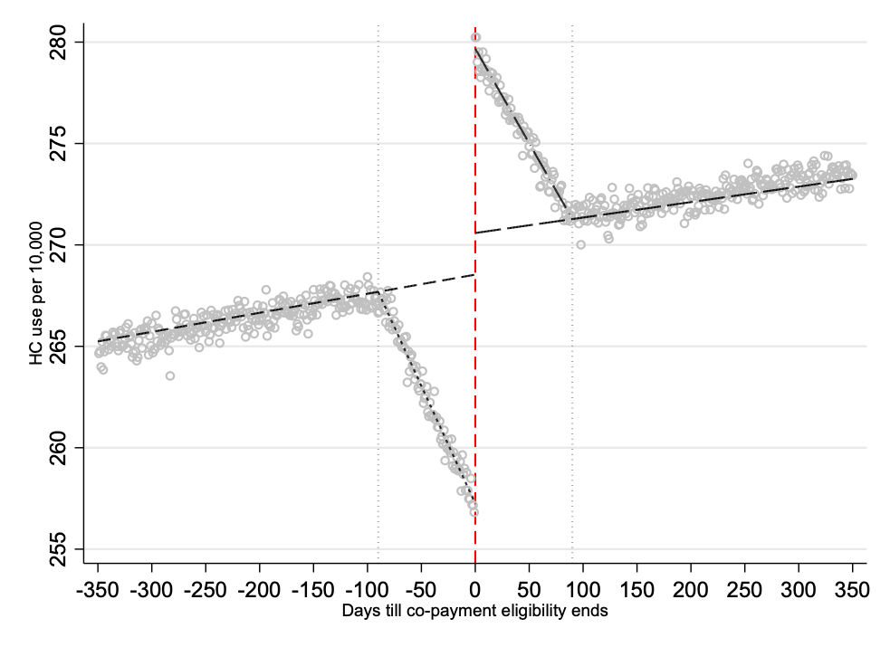

# ReductionsinOut-of-PocketPrices
Replication files and simulations for Johansson et al 2023 JHE


- Current version: `1.0.0 3feb2023`
- Jump to: [`overview`](#overview) [`simulation`](#simulation) [`replication codes`](#replication-codes)  [`data access`](#data-access)  [`update history`](#update-history) [`authors`](#authors) [`references`](#references)

-----------

## Overview 

This repository contains replication files and data for [Johansson, de New, Kunz, Petrie and Svensson (2023)](https://www.sciencedirect.com/science/article/pii/S0167629622001242); more details can be found in the paper. 

The analysis is based on external restricted datasets that we do not re-post here since they are held by different entities. 

Here we describe how to access them and provide our codes. We are encouraging any replication attempt and interested readers shall not hesitate to contact [Naimi Johansson](mailto:naimi.johansson@regionorebrolan.se) about any of these. For brevity, we also exclude the multitude of replication files for the Appendix version but are happy to provide these upon request. 

We first explain our kinked Donut Regression Discontinuity design approach using a simple simulation exercise and then briefly discuss how the results can be replicated (following an application to the data custodians)


## Simulation

#### Estimate kinked Donut  RDD

The figure shows the data and estimated slopes for set bandwidth. 



#### Some STATA estimation command 

Here is an exemplary Stata script (see also simulation folder):

```stata
* Estimate OLS 
reg y PostBd age agePostBd period1age period4age x time 

* Get parameters
su time 
sca meantime = r(mean)*_b[time]
di meantime

su x 
sca meanx = r(mean)*_b[x]
di meanx

loc p1 =  - m
loc p2 =    n

loc start = - window
loc end   =   window
* -----------------------------------------		  
* Effects 
sca longrun  = (_b[_cons] + _b[PostBd] + meantime + meanx -`p2'*_b[period4age]) - (_b[_cons] + meantime + meanx -`p1'*_b[period1age])
di longrun	
	  
sca shortrun =  _b[PostBd]
di shortrun	  
* -----------------------------------------		  
* Area 
sca lower_triang =  0.5*m*(m*_b[period1age])
di lower_triang

sca upper_triang =  0.5*n*(n*_b[period4age])
di upper_triang
```

In the Simulation folder, we also present an example of how to find the optimal bandwidth using a simple grit search algorithm. 

## Replication do-files 

We do not repost the full dataset as these are proprietary, they can be accessed as explained below. 

We present however all data extraction files and all do files used in the main part of the analysis. 

```stata
* Generate working dataset
"1. data set base.do"
*** in this dofile, we set up the structure for the data set "cells_1y_base.dta". 730 observations per individual, one observation per day in relation to the 85th birthday.
"2. sample & backgr covars.do"
*** in this dofile, I prepare the sample's background characteristics e.g. date of 85th birthday "sample.dta", and merge the relevant variables onto "cells_new_1y.dta". 
"3. organize visits data.dofile"
*** in this dofile, I prepare the data sets of visits (visits by date), and merge in variables from "sample.dta" to calculate visits by cellday (day in relation to 85th birthday)

* Dofiles for analysis
"4. Search for optimal donut hole.do"
*** in this dofile, I search for the optimal donut hole (minimizing AIC/BIC)
"5. regression base.do"
*** this dofile contains the main code for the regression analysis, a regression loop for various donut holes and, a post-estimation of fitted values to draw graphical results 
```

## Data access

*Description will be added shortly.*

## Update History
* **February 3, 2023**
  - initial commit
  

## Authors:

[Naimi Johansson](https://sites.google.com/view/naimijohansson/)
<br>Örebro University 

[Sonja De New](https://sites.google.com/site/sonjakassenboehmer/)
<br>Monash University

[Dennis Petrie](https://research.monash.edu/en/persons/dennis-petrie)
<br>Monash University

[Johannes S Kunz](https://sites.google.com/site/johannesskunz/)
<br>Monash University

[Mikael Sevensson](https://sites.google.com/view/mikael-svensson/)
<br>University of Florida

## References: 

Naimi Johansson, Sonja C. De New, Johannes S. Kunz, Dennis Petrie, & Mikael Svensson. 2023. [Reductions in Out-of-Pocket Prices and Forward-Looking Moral Hazard in Health Care.](https://www.sciencedirect.com/science/article/pii/S0167629622001242) Journal of Health Economics. 102710.


