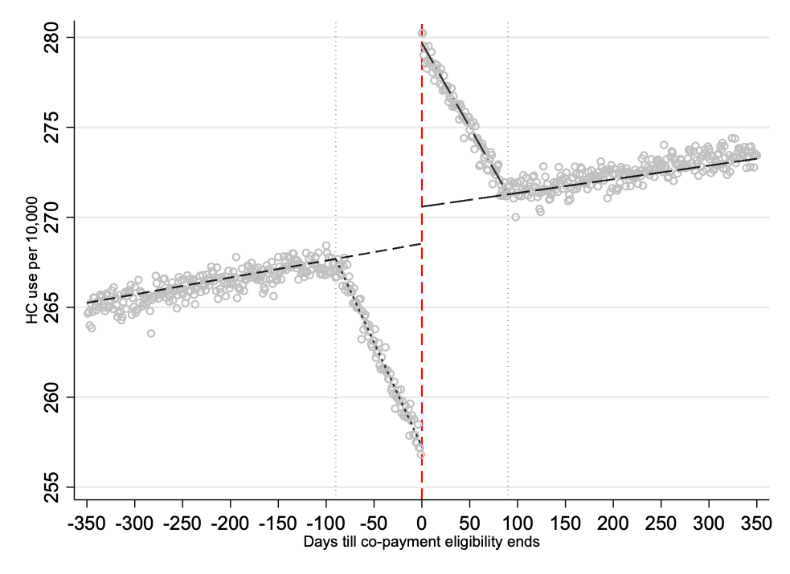

# ReductionsinOut-of-PocketPrices
Replication files and simulations for Johansson et al 2023 JHE

- Current version: `1.0.0 3feb2023`

The simulation contains two versions

1. "1_simul_allinone.do"

will provide a one-shot visualisation of the approach, generating the figure: 

2. Step by step with finding optimal bandwidth 

Generate data set 
"2_1_gen_simuldata.do"

Run regression
"2_2_estmainmodel.do"

Git search for optimal BW various criteria
"2_3_findot_bw"

Please let us know if you have any questions about any of these. We did not standardise this in one program as we expect adjustments to various settings will involve a fair bit of adjustment, were happy to do so however if there is demand. 